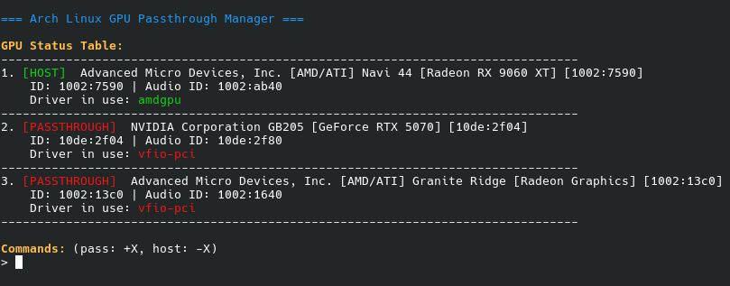

# Arch GPU Passthrough Manager

Bash utility designed for Arch Linux users with multi-GPU setups (AMD/NVIDIA/iGPU). This script automates the isolation of specific GPUs for VFIO passthrough while maintaining a "Rescue" boot option to prevent lockouts.



## Features

- **Rescue Kernel Logic:** Automatically configures IOMMU and VFIO seizure for your "Target" kernel, while blacklisting VFIO and stripping IOMMU flags from all other installed kernels. This ensures that if you accidentally pass through all GPUs, you can simply reboot and select a secondary kernel from the `systemd-boot` menu to recover your system.
- **Dashboard Interface:** Detection of GPUs, their PCI IDs, and the kernel driver currently in use (e.g., `amdgpu`, `nvidia`, or `vfio-pci`).
- **Standardized VFIO Config:** Manages `/etc/modprobe.d/vfio.conf` with proper `softdep` (soft dependencies) for `amdgpu`, `nvidia`, and `nouveau` to ensure `vfio-pci` claims cards before host drivers can interfere.
- **Smart mkinitcpio Integration:** Updates the `MODULES` array in `mkinitcpio.conf` to ensure the correct load order without disturbing other critical modules (encryption, filesystems, etc.).
- **Automated Backups:** Performs timestamped backups of all modified files (e.g., `.bak.1738947600`). If you need to revert, check `/boot/loader/entries/` or `/etc/mkinitcpio.conf.bak.*`.

## Requirements

- **Operating System:** Arch Linux.
- **Bootloader:** `systemd-boot` (files must be in `/boot/loader/entries/`).
- **Hardware:** AMD CPU (script defaults to `amd_iommu=on`).
- **Packages:** `pciutils`, `kmod`, `mkinitcpio`, and `bash`.

## Usage

```bash
sudo ./gpu-manager.sh
```

**Commands:**
- Use `+X` to return a GPU to the **Host** (e.g., `+1`).
- Use `-X` to pass a GPU to **Passthrough/VFIO** (e.g., `-2`).
- You can combine commands: `-2 -3 +1`.

**Select Kernel:** 
The script will prompt you to choose which boot entry should be the "Passthrough" entry. All others will be set as Rescue entries.


